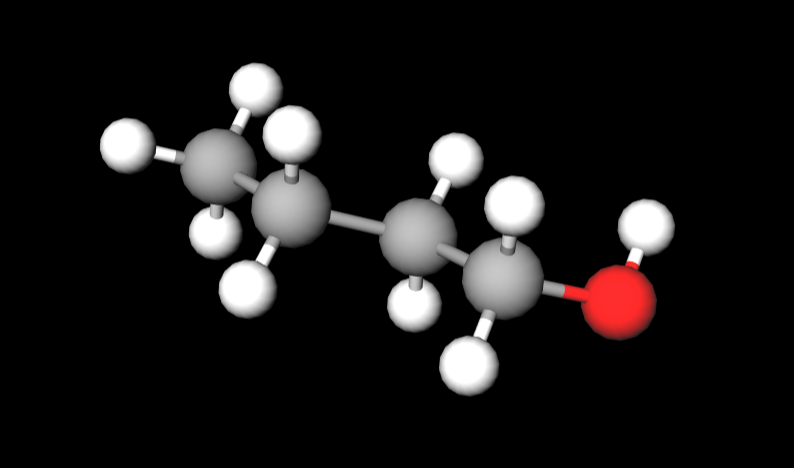
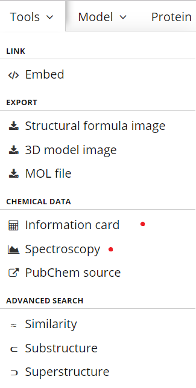
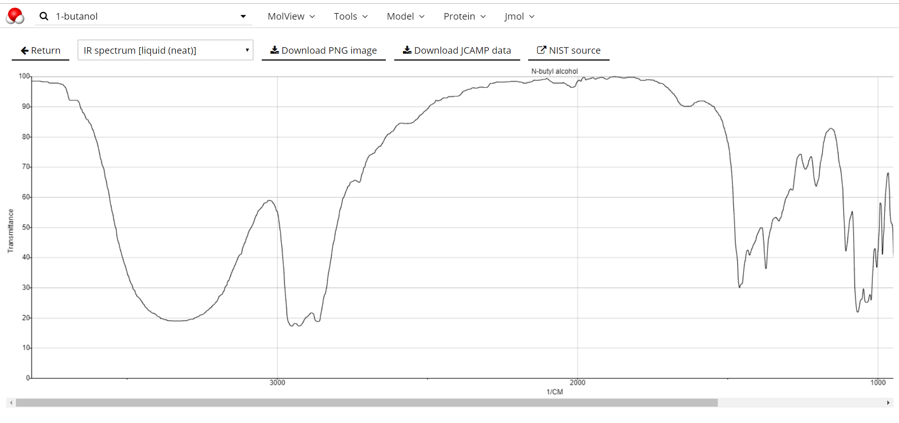

# Wondering what the molecules in Tutorial 11 look like in 3D?
Great let's use a simple online molecular viewers to see these molecules

[Molview](http://molview.org) is easy to use and allows you to build molecules or search for common molecules (which get loaded automatically)

## List of molecules from the tutorial

Click on each link to view the molecule using [Molview](http://molview.org)

- [1-butanol](http://molview.org/?cid=263) 
- [1,4-butanediol](http://molview.org/?cid=8064)
- [chloroform](http://molview.org/?cid=6212)
- [carbon tetrachloride](http://molview.org/?cid=5943)
- [sodium chloride (no lattice just two atoms in space - not a good representation!)](http://molview.org/?cid=5234)
- [methanol](http://molview.org/?cid=887)
- [propanol](http://molview.org/?cid=1031)
- [ethylene glycol](http://molview.org/?cid=174)
- [hexane](http://molview.org/?cid=8058)
- [Ammonium Chloride (no lattice just two molecules in space - not a good representation!)](http://molview.org/?cid=25517)
- [Carbon dioxide](http://molview.org/?cid=280)
- [water](http://molview.org/?cid=962)
- [glycerol](http://molview.org/?cid=753)
- [sodium carbonate (no lattice just two molecules in space - not a good representation!)](http://molview.org/?cid=10340)
- [glucose](http://molview.org/?cid=5793)
- [ethyl bromide](http://molview.org/?cid=6332)

## load proteins directly from the PDB using the PDBID (?pdbid=7CEL)

- [7CEL a fungal hydrolase](http://molview.org/?pdbid=7CEL)

## Interested in Molecular data or spectroscopy data
Select the tools menu choose information card or spectroscopy.

For spectroscopy there will be a selection of mass spec and IR depending on the molecule.
For example, here is the 1-butanol neat liquid IR.

